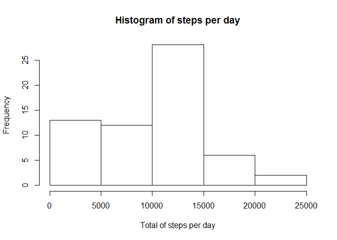
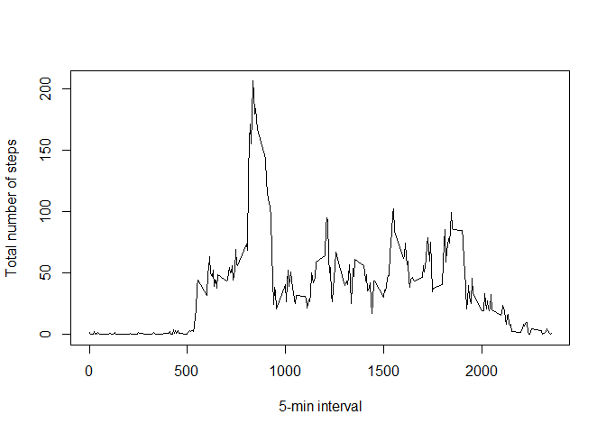
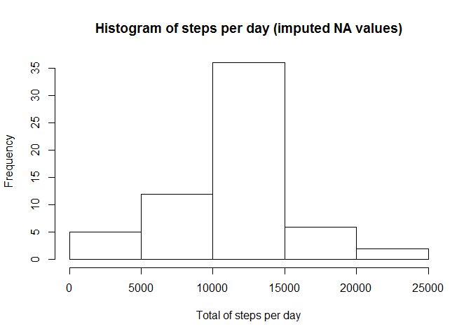
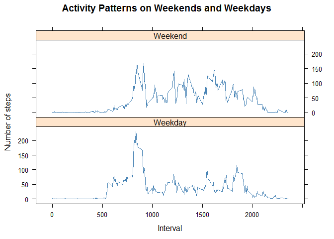

# Reproducible Research: Peer Assessment 1
##Introduction
It is now possible to collect a large amount of data about personal movement using activity monitoring devices such as a Fitbit, Nike Fuelband, or Jawbone Up. These type of devices are part of the "quantified self" movement - a group of enthusiasts who take measurements about themselves regularly to improve their health, to find patterns in their behavior, or because they are tech geeks. But these data remain under-utilized both because the raw data are hard to obtain and there is a lack of statistical methods and software for processing and interpreting the data.


This assignment makes use of data from a personal activity monitoring device. This device collects data at 5 minute intervals through out the day. The data consists of two months of data from an anonymous individual collected during the months of October and November, 2012 and include the number of steps taken in 5 minute intervals each day.


The data is downloaded from https://d396qusza40orc.cloudfront.net/repdata%2Fdata%2Factivity.zip


This report aims to answer these questions:


1. What is mean total number of steps taken per day?
2. What is the average daily activity pattern?
3. Are there differences in activity patterns between weekdays and weekends?


## Loading and preprocessing the data
Load the data from the CSV file in the working directory


```r
# Get the data and load to the R environment
urlData <- "https://d396qusza40orc.cloudfront.net/repdata%2Fdata%2Factivity.zip"
temp <- tempfile()
download.file(urlData,temp)
data <- read.csv(unz(temp, "activity.csv"))
unlink(temp)
```


## What is mean total number of steps taken per day?

```r
# Group observations by date and sum steps taken per each day
library(dplyr)
totalStepsPerDay <- data %>% group_by(date) %>% summarise(total = sum(steps, na.rm = T))

# The histogram to illustrate the total number of steps per day
hist(totalStepsPerDay$total, xlab = "Total of steps per day", main = "Histogram of steps per day")
```

 

```r
# Define total mean and total median of steps sums for each day
totalMean <- mean(totalStepsPerDay$total)
print(totalMean)
```

```
## [1] 9354.23
```

```r
totalMedian <- median(totalStepsPerDay$total)
print(totalMedian)
```

```
## [1] 10395
```


## What is the average daily activity pattern?


```r
avgIntSteps <- data %>% group_by(interval) %>% summarise(avgInt = mean(steps, na.rm = T))
plot(avgIntSteps, type="l", xlab = "5-min interval", ylab="Total number of steps")
```

 

```r
# The maximum total number of step is: 

avgIntSteps$avgInt[which.max(avgIntSteps$avgInt)]
```

```
## [1] 206.1698
```

```r
# which is found at 5-minute interval of:

avgIntSteps$interval[which.max(avgIntSteps$avgInt)]
```

```
## [1] 835
```


## Imputing missing values

There are several NA values in the steps data. The previous calculation do not take into account these NA values.


```r
NAvalues.isNA <-   filter(data, is.na(steps))
NAvalues.notNA <-  filter(data, !is.na(steps))
```
There are 2304 rows of NA.
There are 15264 rows of non NA.


```r
summary(data)
```

```
##      steps                date          interval     
##  Min.   :  0.00   2012-10-01:  288   Min.   :   0.0  
##  1st Qu.:  0.00   2012-10-02:  288   1st Qu.: 588.8  
##  Median :  0.00   2012-10-03:  288   Median :1177.5  
##  Mean   : 37.38   2012-10-04:  288   Mean   :1177.5  
##  3rd Qu.: 12.00   2012-10-05:  288   3rd Qu.:1766.2  
##  Max.   :806.00   2012-10-06:  288   Max.   :2355.0  
##  NA's   :2304     (Other)   :15840
```
###Strategy for filling in all of the missing values in the dataset

The following strategy is chosen: for any NA is the step variable, the mean (of steps) of the corresponding interval is taken as the replacing value.


```r
cleanData <- data  
for (i in 1:nrow(data)){
    if(is.na(data$steps[i])){
        
        interval.sgn <- cleanData[i, "interval"]
        interval.sgn.ind <- which(avgIntSteps[, "interval"] == interval.sgn)
        interval.steps.mean <- avgIntSteps[interval.sgn.ind, "avgInt"]
        cleanData[i,"steps"] <- interval.steps.mean

    }
}

totalStepsPerDayClean <- cleanData %>% group_by(date) %>% summarise(total = sum(steps, na.rm = T))
hist(totalStepsPerDayClean$total, xlab = "Total of steps per day", main = "Histogram of steps per day (imputed NA values)")
```

 

```r
# Define total mean and total median of steps sums for each day
totalMean <- mean(totalStepsPerDayClean$total)
print(totalMean)
```

```
## [1] 10766.19
```

```r
totalMedian <- median(totalStepsPerDayClean$total)
print(totalMedian)
```

```
## [1] 10766.19
```

## Are there differences in activity patterns between weekdays and weekends?

```r
library(chron)
returnWeekend = function(k){
if(k==TRUE)
    return <- "Weekend"
  else
    return <- "Weekday"
}


final <- cleanData %>%
         mutate(weekend=is.weekend(date))%>%  
         group_by(weekend, interval)%>%
         summarise(mean.week=mean(steps))
                   
for (i in 1:nrow(final)){
  final$weekend[i] <- returnWeekend(final$weekend[i])
}

names(final) <- c("week", "interval", "steps")
library(lattice)
xyplot(steps ~ interval | week, final, type = "l", layout = c(1, 
    2), xlab = "Interval", ylab = "Number of steps", main = "Activity Patterns on Weekends and Weekdays", 
    col = "steelblue")
```

 
